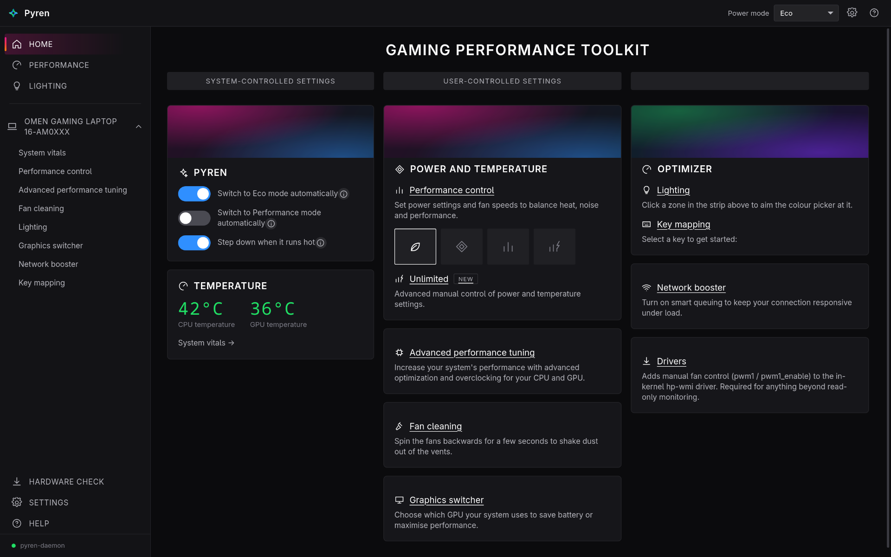

# Pyren

A Tauri-based clone of HP's OMEN Gaming Hub for Linux, built as a
privileged daemon (Rust) plus an unprivileged desktop app (Tauri +
SvelteKit), The project aims to be modular to facilitate the import of external source code and to reduce the security issues that granting privileges can cause.



To create this application, the codebase was derived from the [`omen-fan-control`](https://github.com/arfelious/omen-fan-control) repositories; specifically, the patched **Linux driver**, its Python-based installer (v2.0), and the reverse ventilation logic, while [`omen-rgb-linux`](https://github.com/arfelious/omen-rgb-linux.git) was used to create the RGB control system.

**To install it, see [`install/INSTALL.md`](install/INSTALL.md)** (or the
[Installing](#installing) section below).

[`TEST.md`](TEST.md) is what has actually been tested and verified on
real hardware.

`pyren-ctl status` is the fastest way to see, on one screen, what a running daemon has switched on and what it thinks the machine can do.

## Installing

**→ [`install/INSTALL.md`](install/INSTALL.md) is the full install guide.**

The short version: download the latest
`pyren-<version>-x86_64-linux.tar.gz` from
[Releases](https://github.com/mglourido/PYREN/releases), then

```sh
tar xzf pyren-*-x86_64-linux.tar.gz
cd pyren-*/
sudo ./install.sh
newgrp pyren          # or log out and back in
```

That installs the daemon (as a systemd service), the app, the widget and
the two CLIs, and adds you to the `pyren` group. Launch **Pyren** from your
app menu or run `pyren`; `pyren-check` reports what your laptop can be told
to do. `sudo ./uninstall.sh` reverses it.

You need WebKitGTK (`webkit2gtk-4.1`) and `gtk4` + `gtk4-layer-shell` —
most desktops already have them.
[`install/INSTALL.md`](install/INSTALL.md) covers requirements, every path
touched, `--prefix` / `--dry-run`, and how a maintainer cuts a release. To
build from source instead, see
[`docs/02-development.md`](docs/02-development.md).

## Layout

```
daemon/     Rust workspace: pyren-daemon + pyren-ctl + pyren-check + module crates
app/        Tauri app: SvelteKit frontend + src-tauri shell
osd/        the on-screen-display widget, its own Cargo workspace (GTK layer-shell)
driver/     hp-wmi kernel module, a verbatim copy of upstream's; the installer patches it at build time (C, GPL-2.0-or-later)
docs/       architecture + IPC protocol + development + frontend
dev/        working notes: what is left to do, and what was learned
tools/      helper scripts: release.sh, bump-version.sh, pyren-check.sh, …
install/    the installer (install.sh / uninstall.sh), its .desktop file, and INSTALL.md
```

## Contributing

If you want to help, read [CONTRIBUTING](CONTRIBUTING.md).

## Licensing

Pyren is licensed under the **GNU GPL v3 or later** — see [`LICENSE`](LICENSE).

Two exceptions, both recorded in [`NOTICE`](NOTICE) — third-party material
and upstream credit:

- `driver/` is a verbatim copy of the Linux `hp-wmi` driver, under
  **GPL-2.0-or-later**; it keeps its own headers and copyright and is not
  relicensed. See [`driver/README.md`](driver/README.md). GPL-2.0-or-later
  is compatible with GPL v3, so the combined distribution is fine.
- The fan and RGB modules were written from the behaviour of the upstream
  projects credited in [`NOTICE`](NOTICE); no code from them is copied in.
